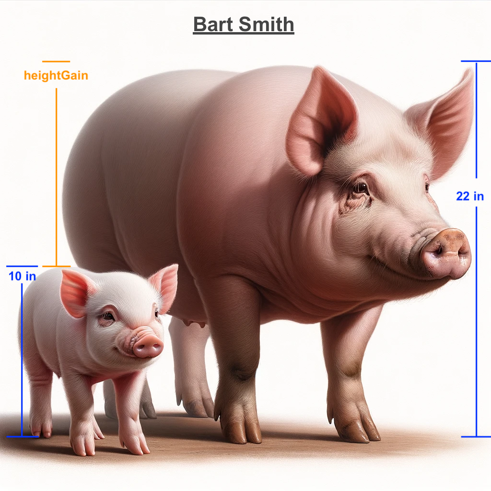
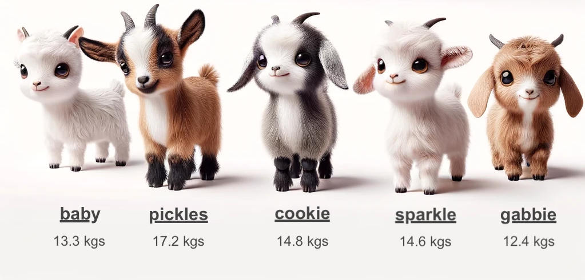
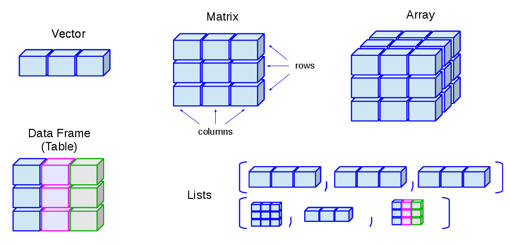

# Data Types and Basic Commands


## Objects

The key to understanding R is that you will be working with what we call “objects”. Anything in R can be an object: a number, a string of characters, a data frame with data, and even plots.

To create any object:

- The command will begin with the name of the new object  
  - followed by: - an assignment operator `<-`  
  - and then the data or expression that defines the content of the
    object.  
- This can include direct values, function calls, operations, or other
  objects.

``` r
objectName <- "word"
```

::: {.callout-tip}
Object names are never wrapped in quotes. String/character values being assigned to an object must be wrapped in quotes. Object names cannot begin with anything other than an alphabetical character, but otherwise can contain special characters and numbers (\*\_13). Object names cannot contain spaces, but string values can.
:::

When we create objects, R keeps track of them, and you check all objects that you have created and that R is keeping track of in your Workspace
panel.

To change the information stored in an object, simply reassign the value to the object. For example, to change the value assigned to the object created above to the number 100:

``` r
objectName <- 100
```

Therefore, as you see, you have to pay attention to not give a new object the same name as a previous object, otherwise R will simply overwrite the older object.

You can also use objects in function calls, for example, you can type `log(objectName)` to ask R to calculate the log of the number stored in your object (100 in this case).

Function
: A set of instructions defined to perform a specific task.

- E.g., help() : ‘help’ is a function to get information

Function call
: The act of executing a function with specific arguments, if required, to produce a result.

- e.g., help(“integer”)
  - This calls the ‘help’ function with the argument (aka parameter)
    “integer”
  - It will return information about an ‘integer’ object type.
- You can use objects as arguments in functions.

## Data Types

While R objects can take many forms, when they store data (rather than, for example, a plot call), R primarily uses five basic data types:

Numeric
: Decimal or floating-point numbers (e.g., 4.5, -3.2).

Integer
: Whole numbers (e.g., 1, -5, 20). In R, integers are often just treated as numeric unless explicitly specified.

Logical
: Boolean values, either TRUE or FALSE. Another type of logical data is `NA`, which indicates missing values.

Character
: Text or strings (e.g., “hello”, “1234”). Note: “1234” is treated as a character because it is between quotes. If you want it to be numeric, you don’t need the quotes.

Factor
: A special type of character data, includes levels or an order (e.g., “low”, “medium”, “high”).

In the exercises below, you will get used to working with these different types of data. First, let’s look at basic operations with objects with **character data**.

Note: whenever you enter a string parameter, the string will more likely than not be wrapped in quotes. If it doesn’t work, add or remove quotes.

::: {.callout}


Task 2-1

**Create an object.**

Create an object for a pig’s first name. The first pig’s first name is
“Bart”.
:::


<details>

<summary>Check your code
</summary>

``` r
# Assign the first name 'Bart' to the first pig (pig1)
pig1.first_name <- "Bart"
```

::: {.callout-note}

You might have created an object with a different name, which
is completely okay (as long as it is an understandable name; remember
the best practices for naming objects from the previous section).
However, we will continue using the object `pig1.first_name` for this
activity, so you might want to use the same name to make it easier to
follow.
:::

</details>


::: {.callout}

 Task 2-2</u>

**Create an object.**

Create an object for Bart’s last name. Bart’s last name is “Smith”.
:::

<details>

<summary>Check your code
</summary>

``` r
# Assign the last name 'Smith' to the first pig (pig1)
pig1.last_name <- "Smith"
```

</details>


::: {.callout}

Task 2-3

**Create an object.**

Create an object that equals Bart’s first and last name, then display
the full name in the console

The `paste()` function combines two strings and inserts a space between
them. `paste()` takes two arguments, like `paste(string1, string2)`
:::

<details>

<summary>Check your code
</summary>

``` r
# Concatenate the first pig's (pig1) first ('Bart') and last name ('Smith')
pig1.full_name <- paste(pig1.first_name, pig1.last_name)

# After pig1.full_name has been created, print (display) Bart’s full name...
pig1.full_name
```

    ## [1] "Bart Smith"

</details>


Now we’ll look at basic operations with **numeric and integer data**.
First, we’ll create height information for Bart and find out how much
he’s grown in height.

{fig-alt="Bart as a piglet and adult"}

::: {.callout}

Task 2-4

**Create an object.**

Create an object for Bart’s height as a piglet: 10
:::


<details>

<summary>Check your code
</summary>

``` r
# Assign the value of Bart’s piglet height
pig1.heightA <- 10
```

</details>


::: {.callout}

 <u>Task 2-5</u>

**Create an object.**

Create an object for Bart’s height now: 22.3
:::

<details>

<summary>
Check your code
</summary>

``` r
# Assign the value of Bart's current height
pig1.heightB <- 22.3
```

</details>


::: {.callout}

 <u>Task 2-6</u>

**Create an object.**

Now create an object expressing the amount he’s grown.
:::

<details>

<summary>Check your code
</summary>

``` r
# Find the difference in height using the expression: 'heightB - heightA' 
# using the subtraction operator. 
pig1.heightGain <- pig1.heightB - pig1.heightA

# after pig1.heightGain has been created, print (display) the value of pig.heightGain...

pig1.heightGain
```

    ## [1] 12.3

</details>

::: {.callout-tip}

“Expressing” indicates that the value will require an
expression, in this case, a mathematical operation.
:::


`pig1.heightA` is an ‘integer’ data type (whole number)

`pig1.heightB` is a ‘numeric’ data type (decimal number)

R can perform operations on different data types, like getting the
difference of a value.


::: {.callout-important}

📍 As you work through these activities, remember to save your script(s)
regularly.
:::

To remove objects from your environment, execute the ‘remove’ function
in the console: `rm()`, e.g. `rm(full_name)`.

**Time for logical or boolean values!**

We can denote whether Bart is small or large with a Boolean value.

::: {.callout}

 <u>Task 2-7</u>

**Create two objects.**

Create two objects (pig1.mini and pig1.large) containing Boolean values
which indicates that Bart is a large pig and not a mini pig.
:::

<details>

<summary>Check your code
</summary>

``` r
pig1.mini <- FALSE

pig1.large <- TRUE
```

</details>

::: {.callout-tip}


*Hint:* Boolean values are either ‘TRUE’ or ‘FALSE’ (case sensitive).
:::

## Data structure

Now that you know which types of data R uses, let’s look at the different ways data can be structured in R. R uses these different structures to store data in objects.

### Vectors

A vector is a 1-dimensional list of items that are of the same data type (all character, all numeric, etc.)

To create a vector object, you will use the `c()` function.

- The ‘c’ stands for ‘combine’.

- It’s used to create a vector by grouping individual values into a
  list-like structure.

- Think of it as placing items into a container where each item remains
  distinct and can be individually accessed.

  - For example, `vector1 <- c(value1, value2)` creates a vector named
    ‘vector1’ containing the elements ‘value1’ and ‘value2’ as separate
    items in a sequence, not as a single merged item.

  - A value in a vector can be accessed by using square brackets and its
    index (the value’s place in the vector), where **1** is the first
    index.

    - `vector1[1]` will output: ‘value1’

Many functions and operations in R are designed to work naturally with
vectors.

::: {.callout}

 <u>Task 2-8</u>

**Create a vector.**

Make a vector for the following weight values of miniature goats. Name
your variable ‘goat.weights’

`Goat weights: 13.3, 17.2, 14.8, 14.6, 12.4`
:::

<details>

<summary>Check your code
</summary>

``` r
# The period between 'goat' and 'weight' has no special purpose. 
# It only shows the person reading the code that 'weights' is information that pertains to the goats
goat.weights <- c(13.3, 17.2, 14.8, 14.6, 12.4)
```

</details>


As a reminder of how R and RStudio work, the command you just ran should
have appeared in your console (bottom left window). The `goat.weight`
vector should also now be listed in the Environment tab (top right
window) under <u>Values</u>.

::: {.callout}

 <u>Task 2-9</u>

**View objects.**

Show the contents of the vector containing the goat weights.

If at any point you want to view the value of an object, you can just
type the name of the object in the console and type ‘enter’ or ‘return’
to execute.
:::

<details>

<summary>Check your code
</summary>

``` r
goat.weights
```

    ## [1] 13.3 17.2 14.8 14.6 12.4

</details>


::: {.callout}

 <u>Task 2-10</u>

**Index vectors**

Display the weight of the second goat in the vector.
:::

<details>

<summary>Check your code
</summary>

``` r
goat.weights[2]
```

    ## [1] 17.2

</details>

::: {.callout-tip}


*Hint:* `vector_name[indexNumber]`
:::

You have just worked with numeric vectors. Now let’s move to character
vectors.

{fig-alt="a row of goats"}

::: {.callout} 
<u>Task 2-11</u>

**Create a new vector.**

Make a vector for the following name values of miniature goats.

Name your variable `goat.name`

Goat names: baby, pickles, cookie, sparkle, gabbie
:::

::: {.callout-note}
Text values must be wrapped in quotations. You can use double
or single quotes, but must be consistent

- Good: `"text"`
- Good: `'text'`
- Bad: `'text"`
:::

<details>

<summary>
Check your code
</summary>

``` r
goat.name <- c("baby", "pickes", "cookie", "sparkle", "gabbie")
```

</details>


To get the length of a vector, we can use the `length()` function.

::: {.callout} 
<u>Task 2-12</u>

**Get vector length**

Display the length of the vector of miniature goat names.
:::

<details>

<summary>
Check your code
</summary>

``` r
length(goat.name)
```

    ## [1] 5

</details>


### Matrices and arrays

A matrix is similar to a vector, but it has an additional dimension.
That means, matrices are objects made of multiple elements of the same
data type (i.e., all characters, or all numeric) that are organized in
rows and columns. Arrays are matrices with multiple dimensions. Matrices
and arrays are used for more advanced calculations in disciplines such
as population ecology and applied statistics, but for basic uses of R,
you will not need to use matrices or arrays.

[If you are interested, however, on learning more about matrices and
arrays, follow this link](https://www.w3schools.com/r/r_matrices.asp){target=“_blank”}.

### Lists

Differently from vectors, matrices or arrays, a list can hold items of
different types. In fact, lists can also hold other data structures in
them, like vectors and matrices. You can think of a list as a
clothesline where you can hang different types of data. For example, you
can add a value at the first position, a vector at the second position,
and a matrix at the third position.

To make a list, we’ll use the `list()` function.

::: {.callout}
<u>Task 2-13</u>

**Create a list**

Create a list with information about Bart’s full name, Bart’s height
gain, the goats’ names and weights.
:::

<details>

<summary>
Check your code
</summary>

``` r
my.list <- list(pig1.full_name, pig1.heightGain, goat.name, goat.weights)
```

</details>


In the same way that you can use `[i]` to capture a value in a vector,
you can use `[[i]]` to capture something in a list (with i being the
number of the location you want to capture)

::: {.callout}
 <u>Task 2-14</u>

**Show an element of a list**

Display the goats’ names by indexing the object `my.list`.
:::

<details>

<summary>
Check your code
</summary>

``` r
my.list[[3]]
```

    ## [1] "baby"    "pickes"  "cookie"  "sparkle" "gabbie"

</details>


### Data frames

Data frames are one of the most used and useful data structure types in
R. We will go over data frames in more detail in section 4.2, but here
you need to know that they are two-dimensional objects made up of rows
and columns, very similar to data tables that you are used to seeing in
Microsoft Excel.

While that might seem similar to what a matrix is, data frames can
contain data of different types, as long as all values in a column are
of the same type. For example, you can have a column of numeric data and
a column of character data.

If you want to create data frames, you can use the `data.frame()`
function. In the next section, instead of creating our own data frames,
we will be importing data.

Now you know all the basic data structures that exist in R. For a
summary of how they look, here’s a good image:

{fig-alt="Data structures in R"}

::: {.callout-important}

📍 As you work through these activities, remember to save your script(s)
regularly. - File -> Save 
:::
