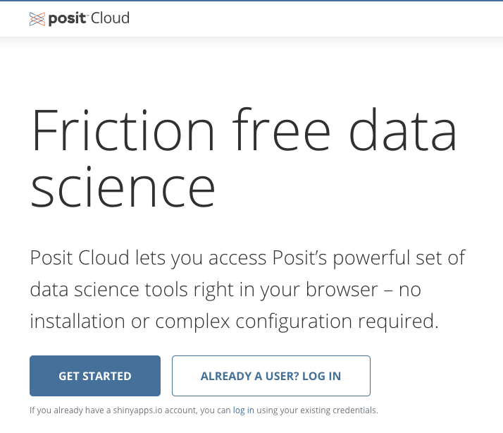

# Getting Started

Please review the following links:

- If not attending a live (in-person or Zoom) session, read the [Introductory Slides](https://docs.google.com/presentation/d/1AJwcQcrGBG6PwnP8S1r-VwJpMAtZwCWSnI7Y7z6cR7Q/edit?usp=sharing){target="_blank"} 
- Video: [Resize Your Laptop Screen for Workshop Handouts (2 min)](https://www.youtube.com/watch?v=Igk5hZUfzN0){target="_blank"}

## Terminology

R
: R is a command line interface (CLI) tool for statistical analyses plus MANY more capabilities.

RStudio  
: RStudio provides a graphical user interface (GUI) for R. 
: RStudio is also known as an integrated development environment (IDE)

Posit Cloud
: Posit Cloud is a web-based version of RStudio. 
: Users on the free tier can use up to 25 hours of compute time per month.
: The interface is identical to RStudio, except for a web wrapper.

Quarto
: Quarto is an academic publishing tool that allows users to embed R scripts into the text of a document
: Quarto is built on pandoc, a universal(ish) file converter.

## Posit Cloud

To begin, go to [posit.cloud](https://posit.cloud) and click "Get Started" or "Already a user? Log in".

{fig-alt="Portion of the Posit Cloud website with two buttons. The first says 'Get Started' and the second says 'Already a user? Log in'"}

Follow the instructions to set up a free account on posit.cloud.

### Your Workspace

You have a workspace that only you can access, available in the left-side menu.

{fig-alt="portion of the Posit Cloud interface showing the 'Workspace' link."}

### Create a Project

On the right side of your workspace page, click the 'New Project' button.

{fig-alt="portion of the Posit Cloud interface showing the 'New Project' link."}

Choose the "New RStudio Project" option.

