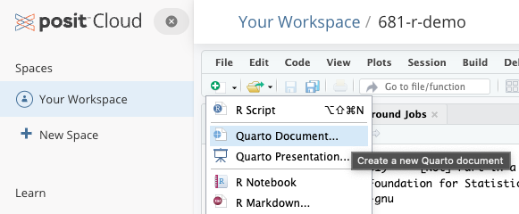
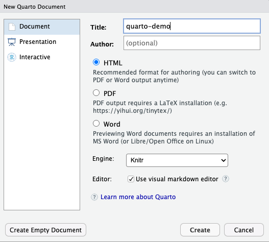
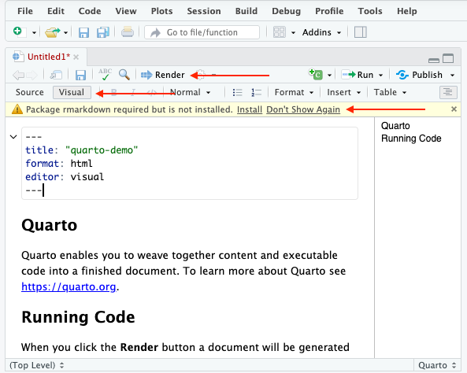

# Introducing Quarto

Quarto is a scientific and academic publishing platform that uses pandoc, a universal file converter, to render text-based markdown files into a wide range of outpur formats. Output options include HTML, PDF, ePub, MS Word, MS Powerpoint, MS Excel, and many others. HTML output options include websites (like this one), blogs, dashboards, books, and academic manuscripts (which can follow the formats of many journals).

Quarto is designed specifically to allow you to create documents with R code embedded directly inside the document, inline with the text.

For example, in the previous activities, we used the `income.csv` file to import into RStudio, and then we made some calculations and created some plots. 

To see how a quarto file works, add a new file to your project, but instead of choosing an R script, choose "Quarto document".

{fig-alt="new file menu in rstudio and posit cloud"}

Give the file a name and leave the other settings as they are.

{fig-alt="new quarto file options in rstudio and posit cloud"}

I have highlighted a few items in the image below, including the 'REnder' button, the 'Source/Visual' option, and the notice that you need to install the `rmarkdown` package.

{fig-alt="new quarto file options in rstudio and posit cloud"}

The top of the quarto file contains a block of information set apart by three dashes before and after. This is called the YAML block (Yet Another Markup Language), and it sets a huge variety of options for your document. You can leave the YAML as it is for now.

Once you have installed `rmarkdown`, click "Render" to get a preview of the html document created from your `quarto-demo.qmd` file.

::: {.callout}
Task 4-1

Copy some of the code chunks from your previous tasks and embed them into the quarto file, then render again.

Make sure your code chunks are inside an R code block.

:::

Check your code.

View the quarto file in the Source view to see the proper syntax.

::: {.callout}
Task 4-2

Load the `penguins` dataset (it is included in R) and see what you can learn about it.
:::

There is MUCH more to learn about Quarto and how it supports reproducible research...stay tuned.