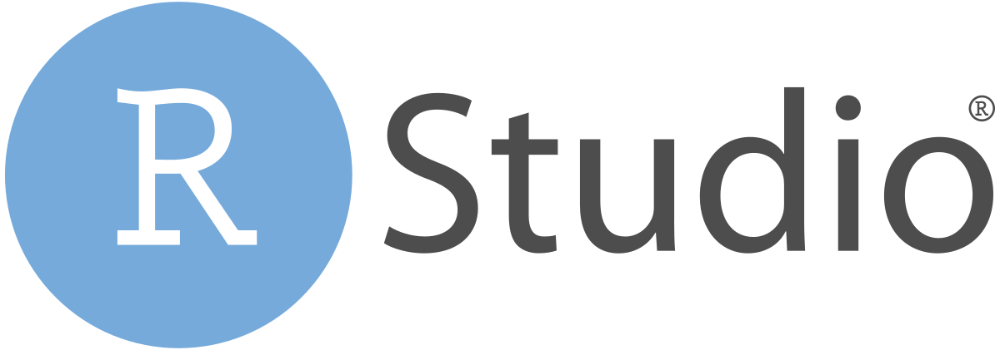
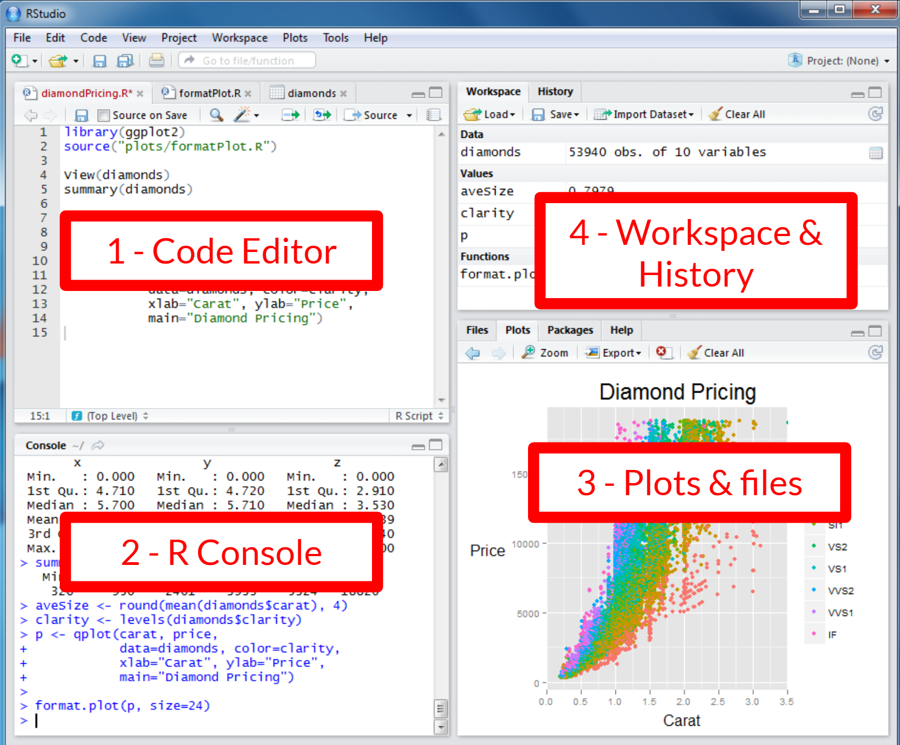
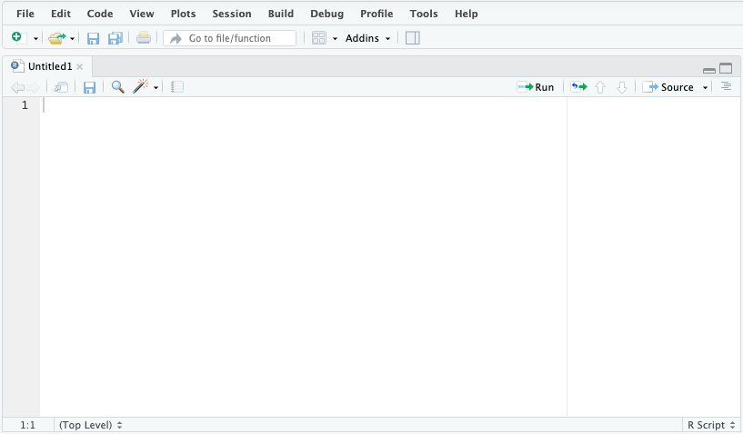
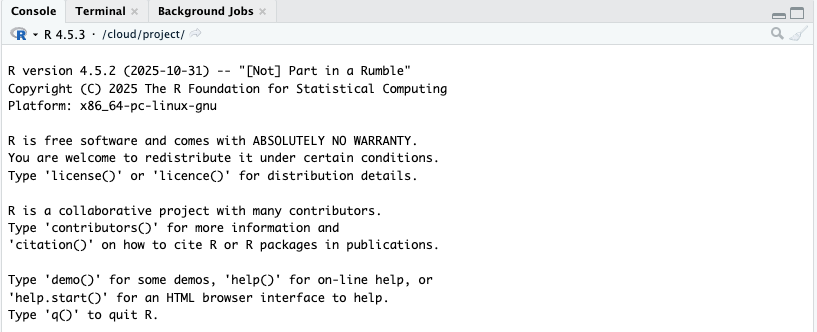
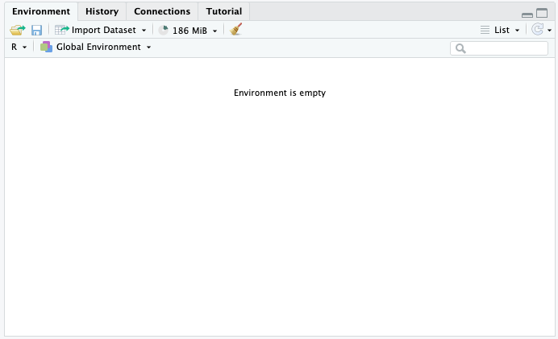
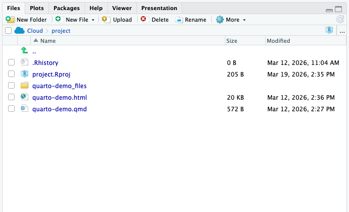
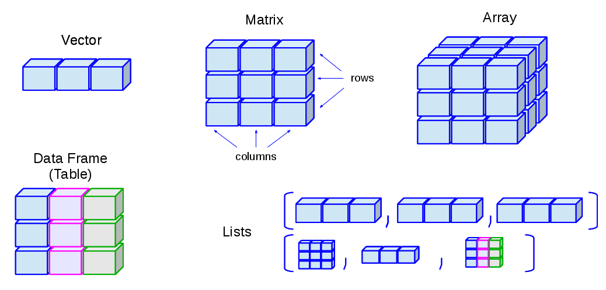
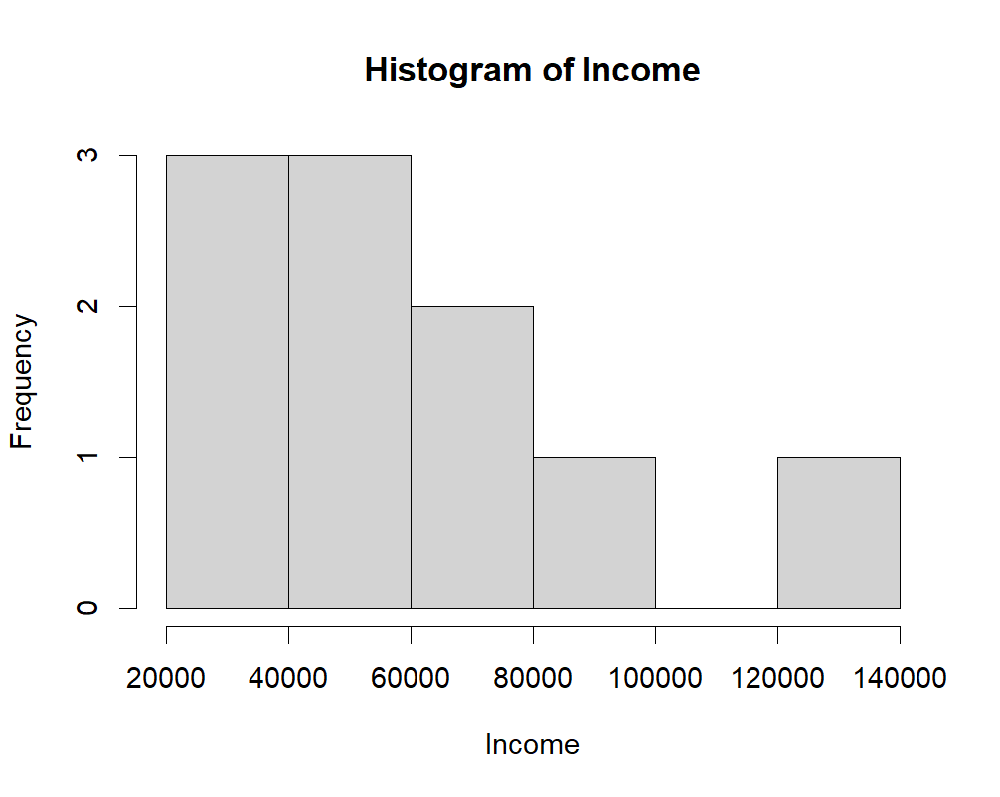

## Introduction to Statistics in RStudio and Quarto

::: {.columns}
::: {.column}
{fig-alt="RStudio Logo"}
:::
::: {.column}
{fig-alt="Quarto Logo"}
:::
:::

::: aside
This presentation and workshop are forked from the [Digital Scholarship Commons](https://docs.google.com/presentation/d/1AJwcQcrGBG6PwnP8S1r-VwJpMAtZwCWSnI7Y7z6cR7Q/edit?slide=id.gf90d559b63_3_0#slide=id.gf90d559b63_3_0) at UVic
:::

---

## Why not MS Excel?

- Made to handle larger datasets  
- More detailed and easily customizable visualizations  
- More advanced statistical analysis  
- Industry standard for data scientists  
- Can more easily handle subsets of your data  

---

## Why not MS Excel?

- Excel: easier for basic functions and/or small amounts of data  
- R: easier for complex functions and/or large amounts of data  

Are there any questions about why researchers use RStudio instead of Excel.


---

## Why R?

- R, RStudio, and Quarto are free and open-sourced!  
- Advanced data analysis, manipulation, and visualization  
- Reproducible research  
- R has a supportive community and high quality learning resources online  

---

## Quick Tour {.smaller}

{.r-stretch fig-alt="Layout of the RStudio interface"}

---

## Code Editor

::: {.columns}
::: {.column width="40%"}
- Plain text files  
- Code is not executed  
  - To execute code, need to send it to the console (run the code)  
- Script file can be saved for later to recreate analysis   

:::
::: {.column width="60%"}
{fig-alt="Code Editor"}
:::
:::

---

## Console

::: {.columns}
::: {.column width="60%"}
{fig-alt="Posit Console"}
:::
::: {.column width="40%"}
- Where code is executed  
- Where outputs and errors messages appear  
- Code that you don’t want to save for later can be typed directly in the console (e.g., installing a package)  

:::
:::

---

## Environment

::: {.columns}
::: {.column width="40%"}
- Shows all the virtual objects you created in your R session  
- Can be used to check if the commands have been properly executed  

:::
::: {.column width="60%"}
{fig-alt="Posit Environment"}
:::
:::
<!-- end columns -->

---

## Plots, Files, Packages...

::: {.columns}
::: {.column width="60%"}
{fig-alt="Posit files, plots, packages"}
:::
::: {.column width="40%"}
- Where plots appear  
- File tab to navigate files  
- Help tab to see R and functions documentation  
- Package tab lists all installed packages  

:::
:::
<!-- end columns -->

---

## Help in R
**General Help**  
- R Homepage : https://www.r-project.org/   
- Google is your friend!  
- GenAI tools can sometimes be helpful.   

**Command-specific Help** (in console)  
- `?[command]` brings up the documentation   

::: {.callout-tip}
Learning to read and understand R errors is a great way to catalyze your R learning journey. Copy the error and paste into a web search.

:::

---

- Activity 1: Navigating the RStudio interface  
- Activity 2: Data types & Basic commands  
- Activity 3: Basic Data Analysis  

---


## Activity 2 - Data types & Basic commands

{fig-alt="Data types in R"}

---

## Activity 3 - Basic Data Analysis

::: {.columns}
::: {.column width="60%"}
{fig-alt="Histogram of Income"}
:::
::: {.column width="40%"}
- Uploading your data  
- Summarizing your data  
- Mean  
- Median  
- Standard deviation  
- Making histograms  

:::
:::
<!-- end columns -->


---

## Troubleshooting

```
# Create an object with values

values <- c(1, 2, 3, 4, 5)

# Calculate the mean of `values`

mean(value)

```

